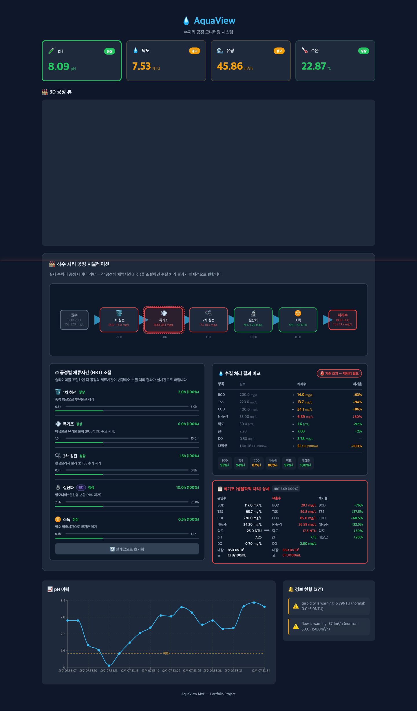
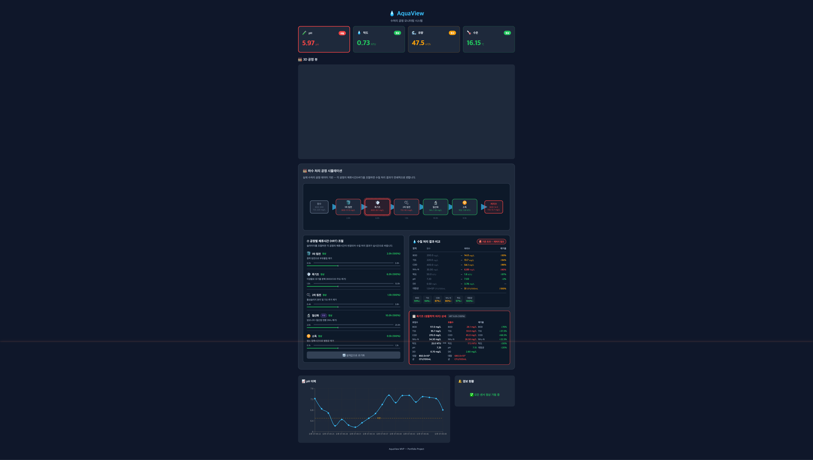

# 💧 AquaView

**수처리 공정 모니터링 시스템** — 실시간 센서 데이터 + 하수 처리 파이프라인 시뮬레이션 + Unity 3D 시각화를 결합한 풀스택 대시보드

## 📸 스크린샷

### 실시간 센서 대시보드


### 하수 처리 공정 시뮬레이션


## 🎯 프로젝트 개요

AquaView는 수처리 시설의 핵심 센서(pH, 탁도, 유량, 수온)를 실시간으로 모니터링하고, 5단계 하수 처리 파이프라인을 시뮬레이션하는 웹 기반 대시보드입니다. FastAPI 백엔드가 센서 데이터와 파이프라인 계산을 처리하고, React 프론트엔드가 차트·공정도·HRT 슬라이더를 표시하며, Unity WebGL이 3D 공정 뷰를 제공합니다.

## 🏗️ 아키텍처

```
+------------------+      HTTP/REST      +------------------+    postMessage     +------------------+
|     FastAPI      | <=================> |      React       | ================> |   Unity WebGL    |
|     Backend      |    3s Polling       |    Dashboard     |                   |    3D View       |
|                  |                     |                  |                   |                  |
|  - Sensor Sim    |                     |  - Realtime Chart|                   |  - Tank Level    |
|  - REST API      |                     |  - Alert Panel   |                   |  - Pipe Color    |
|  - Status Check  |                     |  - Sensor Cards  |                   |  - Sensor Labels |
+------------------+                     +------------------+                   +------------------+
```

## 📊 모니터링 센서

| 센서 | 단위 | 정상 범위 | 경고 범위 | 위험 범위 |
|------|------|----------|----------|----------|
| pH | pH | 6.5 ~ 8.5 | 6.0~6.5 / 8.5~9.0 | <6.0 / >9.0 |
| 탁도 | NTU | 0 ~ 5 | 5 ~ 10 | >10 |
| 유량 | m³/h | 50 ~ 150 | 30~50 / 150~180 | <30 / >180 |
| 수온 | °C | 15 ~ 25 | 10~15 / 25~30 | <10 / >30 |

## 🛠️ 기술 스택

### Backend
- **Python 3.9+** / **FastAPI** / **Uvicorn**
- 인메모리 센서 시뮬레이션 (Gaussian drift 기반)
- REST API (3개 엔드포인트)

### Frontend
- **React 19** / **Vite** / **Recharts**
- 3초 폴링 기반 실시간 갱신
- 반응형 다크 테마 대시보드

### 3D Visualization
- **Unity 6** (URP) / **WebGL**
- React ↔ Unity postMessage 브릿지
- 실시간 센서 연동 (수위, 색상, 텍스트)

### Deployment
- **Docker** / **Docker Compose**
- **AWS EC2** (t3.micro 프리티어)

## 📁 프로젝트 구조

```
aquaview/
├── backend/
│   ├── app/
│   │   ├── main.py              # FastAPI 앱, CORS 설정
│   │   ├── models.py            # Pydantic 모델
│   │   ├── simulator.py         # 센서 시뮬레이션 엔진
│   │   └── routers/
│   │       ├── sensors.py       # GET /api/sensors
│   │       ├── alerts.py        # GET /api/alerts
│   │       └── history.py       # GET /api/history
│   ├── Dockerfile
│   └── requirements.txt
├── frontend/
│   ├── src/
│   │   ├── api/client.js        # API 호출 함수
│   │   ├── hooks/usePolling.js  # 폴링 커스텀 훅
│   │   ├── components/
│   │   │   ├── SensorCard.jsx              # 센서 카드
│   │   │   ├── HistoryChart.jsx            # 시계열 차트
│   │   │   ├── AlertPanel.jsx              # 경보 패널
│   │   │   ├── Unity3DView.jsx             # 3D 뷰 iframe 브릿지
│   │   │   ├── ProcessFlowDiagram.jsx      # SVG 공정 흐름도 (클릭 가능)
│   │   │   ├── HRTControls.jsx             # 공정별 HRT 슬라이더 패널
│   │   │   └── WaterQualityComparison.jsx  # 원수 vs 처리수 비교 카드
│   │   ├── App.jsx
│   │   └── App.css
│   ├── public/unity/            # WebGL 빌드 결과물
│   ├── Dockerfile
│   └── nginx.conf
├── unity/AquaView3D/            # Unity 6 프로젝트
│   └── Assets/Scripts/
│       ├── SensorDataReceiver.cs   # 데이터 수신 싱글톤 (센서 + 파이프라인)
│       ├── TankController.cs       # 탱크 수위/색상 제어 (Raw/Clean 역할)
│       ├── OrbitCamera.cs          # 마우스 드래그/스크롤 카메라
│       ├── PumpAnimator.cs         # 유량 기반 펌프 회전 애니메이션
│       ├── WaterFlowParticle.cs    # 탁도/유량 기반 파티클 시스템
│       └── UIController.cs         # 5단계 공정 상태 UI 오버레이
├── docker-compose.yml
└── CLAUDE.md
```

## 🚀 실행 방법

### 로컬 개발

```bash
# Backend (port 8000)
cd backend
pip install -r requirements.txt
python3 -m uvicorn app.main:app --reload

# Frontend (port 5173)
cd frontend
npm install
npm run dev
```

브라우저에서 http://localhost:5173 접속

### Docker 배포

```bash
HOST_IP=<서버IP> docker-compose up -d --build
```

## 📡 API 엔드포인트

| Method | Endpoint | Description |
|--------|----------|-------------|
| GET | `/api/sensors` | 4개 센서 현재값 + 상태 |
| GET | `/api/alerts` | 경고/위험 상태 경보 목록 |
| GET | `/api/history?sensor={type}&limit={n}` | 센서별 시계열 이력 |
| GET | `/api/pipeline` | 기본 HRT(100%)로 파이프라인 계산 결과 반환 |
| POST | `/api/pipeline/params` | HRT 비율 배열 → 5단계 연쇄 계산 실행 |

## 🏭 파이프라인 시뮬레이션

실제 EPA/WEF 수처리 기준 데이터 기반 5단계 연쇄 계산 엔진:

```
원수 (BOD 200, TSS 220 mg/L)
  ↓ [1차 침전]  HRT 2h   — TSS/BOD 중력 침전 제거
  ↓ [폭기조]    HRT 6h   — 미생물 유기물 분해 (BOD/COD 주요 제거)
  ↓ [2차 침전]  HRT 1.5h — 활성슬러지 분리
  ↓ [질산화]    HRT 10h  — NH₃→NO₃ 변환 (암모니아 제거)
  ↓ [소독]      HRT 0.5h — 염소 CT값 기반 병원균 제거
처리수 (BOD <10, TSS <10 mg/L 목표)
```

HRT 슬라이더를 조절하면 시그모이드 커브 기반으로 각 공정의 제거율이 연쇄적으로 변화합니다.

## 🎮 3D 뷰 통신 흐름

```
React (usePolling 3초)
  └─ fetchSensors() + fetchPipeline() → JSON 수신
      ├─ postMessage({ type: "SENSOR_UPDATE", sensors })
      │   └─ Unity → SensorDataReceiver → TankController(Raw), PumpAnimator, WaterFlowParticle
      └─ postMessage({ type: "PIPELINE_UPDATE", pipeline })
          └─ Unity → SensorDataReceiver → TankController(Clean), UIController(5단계 상태 오버레이)
```
